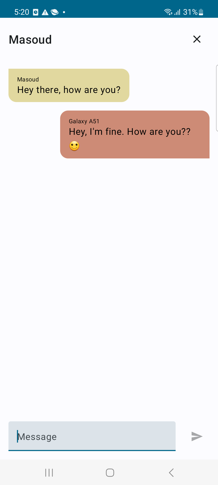
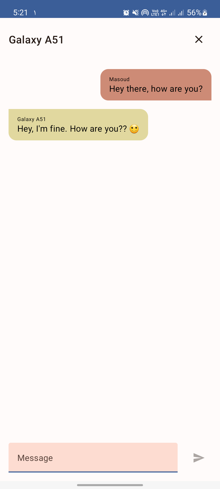

# Bluetooth Chat Application

## Overview

This Android application allows users to establish a Bluetooth connection between two devices and exchange 
messages seamlessly. The project is based on the tutorial series by Philipp Lackner, which you can 
find [here](https://www.youtube.com/watch?v=8ypJkxU4FCw).

  
  

## Features

- Search for nearby devices with Bluetooth turned on.
- Pair two devices for a secure Bluetooth connection.
- Exchange messages between connected devices.

## Getting Started

### Prerequisites

- Android Studio installed on your development machine.
- Android device with Bluetooth capabilities for testing.

### Clone the Repository

git clone https://github.com/masoudkarimi/BluetoothChat.git

### Open in Android Studio

1. Open Android Studio.
2. Select "Open an existing Android Studio project."
3. Navigate to the directory where you cloned the repository and select it.

### Run on Emulator or Physical Device

1. Connect your Android device to your development machine or start an emulator.
2. Click the "Run" button in Android Studio to build and install the application on the device.

## Usage

1. Launch the application on both devices.
2. The app will prompt you to activate Bluetooth.
3. Enable device discoverability as requested by the app.
4. Tap the **Start Scan** button to locate nearby devices.
5. Once your devices are visible, proceed to establish a connection.
6. On one device, press the **Start Server** button, and on the other, select the desired device from the list.
7. Upon successful pairing, the chat screen will be displayed.
8. Enjoy the chat! :)

## Troubleshooting

- Ensure Bluetooth is enabled on both devices.
- Check device visibility settings.
- Make sure the devices are paired correctly.

## Acknowledgments

- Philipp Lackner for the excellent tutorial series.